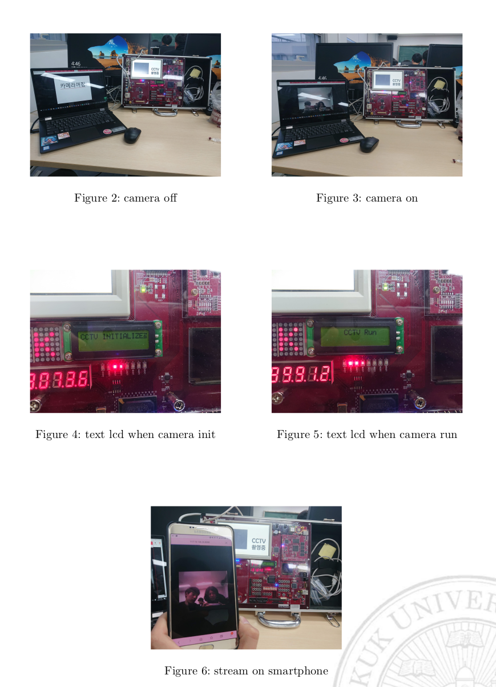

# EMPOS III CCTV solution
empos III 보드를 이용한 CCTV 솔루션. 자세한 사항은 readme_report.pdf 참조.
## server
서버 프로그램. EMPOS III 보드의 임베디드 리눅스 상에서 구동. libjpeg 8a upper 의존성.  
카메라 영상을 jpeg화상으로 변환한뒤 mjpeg를 이용 8080 포트로 보냄. 웹브라우저, vlc 플레이어 등등을 이용해 확인가능
## cla
클라이언트 프로그램. opencv 의존성.
위 서버의 주소를 입력하면 opencv를 이용해 움직임감지와 얼굴감지 사용, 움직임 감지를 이용해 움직임이 있을때만 동영상으로 저장
## result

